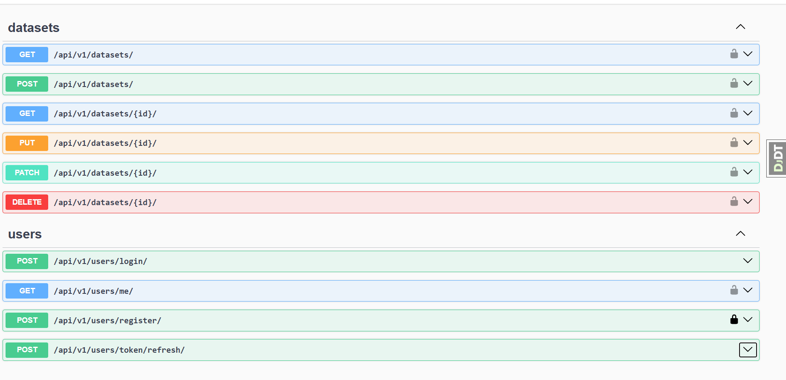

# Platform With Dashboards

> Аналитическая платформа с настраиваемыми дашбордами


## О проекте

REST API платформа для загрузки данных (CSV/Excel) и их визуализации
через настраиваемые дашборды. Поддерживает ролевую модель пользователей
и асинхронную обработку файлов через Celery.

## API Preview




## Стек технологий

| Категория | Технологии |
|-----------|-----------|
| Backend | Python 3.13, Django 6.0, DRF |
| База данных | PostgreSQL, Redis |
| Очереди | Celery + Redis |
| Авторизация | JWT (SimpleJWT) |
| Линтеры | ruff |
| Тесты | pytest-django, coverage |
| API Docs  | Swagger UI, ReDoc  |
| DevOps | Docker, GitHub Actions, Nginx |

## Быстрый старт

### Требования
- Python 3.13+
- PostgreSQL 16+
- Redis 7+
- Poetry 2.0+

### Установка
```bash
git clone https://github.com/KuPriv/platform-with-dashboards.git
cd platform-with-dashboards

poetry install
cp .env.example .env
# заполнить .env своими значениями

poetry run python manage.py migrate
```

### Запуск
```bash
# Redis
docker run -d -p 6379:6379 redis:7

# Django
poetry run python manage.py runserver

# Celery (Windows)
poetry run celery -A config worker -l info --pool=solo

# Celery (Linux/Mac)
poetry run celery -A config worker -l info
```

### Тесты
```bash
poetry run coverage run -m pytest -q
poetry run coverage report
```

## Архитектура
```
platformwithdashboards/
├── apps/
│   ├── core/         # Базовая модель, общие permissions
│   ├── users/        # JWT-аутентификация, роли
│   ├── datasets/     # Загрузка CSV/Excel, Celery-задачи
│   ├── dashboards/   # Дашборды и графики
│   └── notifications/# Email-уведомления
└── config/           # Django настройки (base/local/production)
```

## Функциональность

- [x] Настройка проекта и CI/CD
- [x] JWT аутентификация
- [x] Загрузка и парсинг CSV/Excel файлов
- [x] API документация (Swagger/ReDoc)
- [ ] Настраиваемые дашборды с графиками
- [ ] Экспорт в PDF/Excel
- [ ] Email-алерты при пороговых значениях
- [ ] Docker-деплой с Nginx

## API Documentation
- Swagger UI: http://localhost:8000/api/v1/docs/
- ReDoc: http://localhost:8000/api/v1/redoc/

## Лицензия

MIT © [KuPriv](https://github.com/KuPriv)
